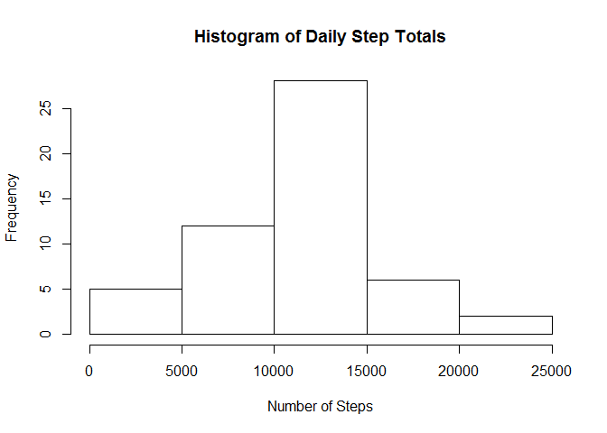
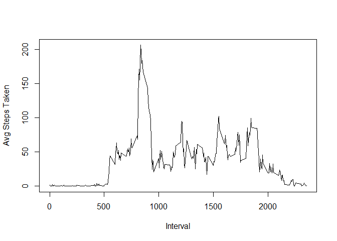
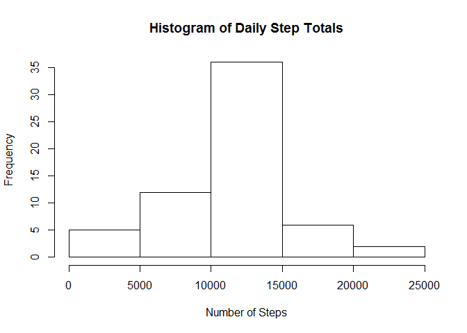
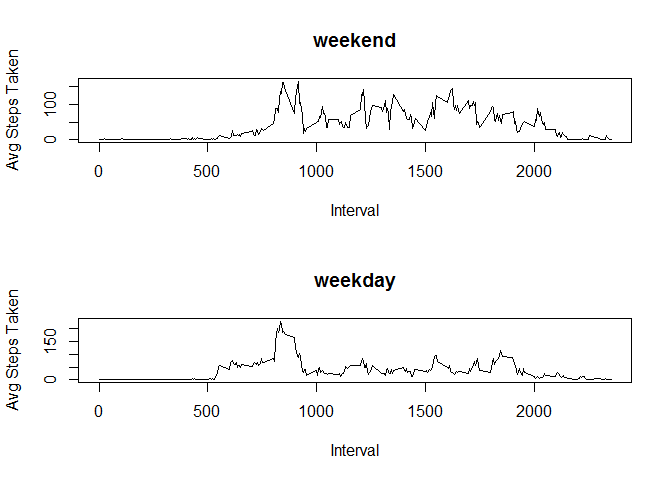

# Reproducible Research: Peer Assessment 1


## Loading and preprocessing the data

Read in file and convert date to be a date.  Check out the structure of it's contents


```r
act<-read.table(unz("activity.zip", "activity.csv"), header = TRUE, sep=",")

act$date<-as.Date(act$date)

str(act)
```

```
## 'data.frame':	17568 obs. of  3 variables:
##  $ steps   : int  NA NA NA NA NA NA NA NA NA NA ...
##  $ date    : Date, format: "2012-10-01" "2012-10-01" ...
##  $ interval: int  0 5 10 15 20 25 30 35 40 45 ...
```

## What is mean total number of steps taken per day?

Calculate the total number of steps taken per day


```r
totalDailySteps<-tapply(act$steps, act$date, sum)

totalDailySteps
```

```
## 2012-10-01 2012-10-02 2012-10-03 2012-10-04 2012-10-05 2012-10-06 
##         NA        126      11352      12116      13294      15420 
## 2012-10-07 2012-10-08 2012-10-09 2012-10-10 2012-10-11 2012-10-12 
##      11015         NA      12811       9900      10304      17382 
## 2012-10-13 2012-10-14 2012-10-15 2012-10-16 2012-10-17 2012-10-18 
##      12426      15098      10139      15084      13452      10056 
## 2012-10-19 2012-10-20 2012-10-21 2012-10-22 2012-10-23 2012-10-24 
##      11829      10395       8821      13460       8918       8355 
## 2012-10-25 2012-10-26 2012-10-27 2012-10-28 2012-10-29 2012-10-30 
##       2492       6778      10119      11458       5018       9819 
## 2012-10-31 2012-11-01 2012-11-02 2012-11-03 2012-11-04 2012-11-05 
##      15414         NA      10600      10571         NA      10439 
## 2012-11-06 2012-11-07 2012-11-08 2012-11-09 2012-11-10 2012-11-11 
##       8334      12883       3219         NA         NA      12608 
## 2012-11-12 2012-11-13 2012-11-14 2012-11-15 2012-11-16 2012-11-17 
##      10765       7336         NA         41       5441      14339 
## 2012-11-18 2012-11-19 2012-11-20 2012-11-21 2012-11-22 2012-11-23 
##      15110       8841       4472      12787      20427      21194 
## 2012-11-24 2012-11-25 2012-11-26 2012-11-27 2012-11-28 2012-11-29 
##      14478      11834      11162      13646      10183       7047 
## 2012-11-30 
##         NA
```

Create histogram of total number of daily steps


```r
par(mfrow=c(1,1))

hist(tapply(act$steps, act$date, sum), main = "Histogram of Daily Step Totals", 
     xlab = "Number of Steps")
```




Calculate the mean and median total daily steps


```r
mean(totalDailySteps, na.rm = TRUE)
```

```
## [1] 10766.19
```

```r
median(totalDailySteps, na.rm = TRUE)
```

```
## [1] 10765
```


## What is the average daily activity pattern?


Make a time series plot (i.e. type = "l") of the 5-minute interval (x-axis) 
and the average number of steps taken, averaged across all days (y-axis)


```r
library(dplyr)
```

```
## 
## Attaching package: 'dplyr'
```

```
## The following objects are masked from 'package:stats':
## 
##     filter, lag
```

```
## The following objects are masked from 'package:base':
## 
##     intersect, setdiff, setequal, union
```

```r
grouped<-group_by(act, interval)

intmean<-summarize(grouped, intmean = mean(steps, na.rm = TRUE))

with(intmean, plot(interval, intmean, type = "l", ylab = "Avg Steps Taken", 
                   xlab = "Interval"))
```



Determine which 5-minute interval, on average across all the days in the dataset, 
contains the maximum number of steps?


```r
intmean[which.max(intmean$intmean),]
```

```
## Source: local data frame [1 x 2]
## 
##   interval  intmean
##      (int)    (dbl)
## 1      835 206.1698
```


## Imputing missing values

Calculate and report the total number of missing values in the dataset 
(i.e. the total number of rows with NAs)


```r
sum(!complete.cases(act))
```

```
## [1] 2304
```


A strategy for handling the missing data is to replace the NA values with the
mean for that five minute interval and from all the other data in the dataset

We create a new dataset that is equal to the original dataset but with the 
missing data filled in using the aforementioned approach.


```r
act2<-act

act2$intmean <-intmean$intmean[ match(act2$interval, intmean$interval)]

steps.1 <- ifelse(is.na(act2$steps), act2$intmean, act2$steps)

act2$steps <- steps.1

act2<-act2[,1:3]
```

Using this new dataset with imputed data for the missing values we can create
another histogram of the total daily steps.  We note it doesn't differ much from
the histogram of the original dataset.


```r
hist(tapply(act2$steps, act2$date, sum), main = "Histogram of Daily Step Totals", 
     xlab = "Number of Steps")
```



We also calculate the mean and median total number of steps per day from the 
imputed dataset.  The values do not differ significantly from the original
dataset which would be expected given the method we used to impute the data (eg.
use the mean).


```r
totalDailySteps.imp<-tapply(act2$steps, act2$date, sum)


mean(totalDailySteps.imp, na.rm = TRUE)
```

```
## [1] 10766.19
```

```r
median(totalDailySteps.imp, na.rm = TRUE)
```

```
## [1] 10766.19
```


## Are there differences in activity patterns between weekdays and weekends?

To determine differences between in activity on weekends vs weekdays we 
create a new variable on the imputed dataset identifying each day as either
being a weekday or a weekend.


```r
act2$dayCat<-as.factor(ifelse(weekdays(act2$date) %in% c("Saturday", "Sunday")
                              ,"weekend", "weekday")) 
```


We then can subset the data based on these categories and calculate the
mean activity for each interval across all data in the weekend and/or weekday
categories


```r
act2.wkday <- subset(act2, act2$dayCat == "weekday")

grouped.wkday<-group_by(act2.wkday, interval)

intmean.wkday<-summarize(grouped.wkday, intmean = mean(steps, na.rm = TRUE))

act2.wkend <- subset(act2, act2$dayCat == "weekend")

grouped.wkend<-group_by(act2.wkend, interval)

intmean.wkend<-summarize(grouped.wkend, intmean = mean(steps, na.rm = TRUE))
```


Finally we create a panel plot giving a visualization of the differences between
weekend and weekday activity.


```r
par(mfrow=c(2,1))

with(intmean.wkend, plot(interval, intmean, type = "l", ylab = "Avg Steps Taken", 
                         xlab = "Interval", main = "weekend"))


with(intmean.wkday, plot(interval, intmean, type = "l", ylab = "Avg Steps Taken", 
                         xlab = "Interval", main = "weekday"))
```


